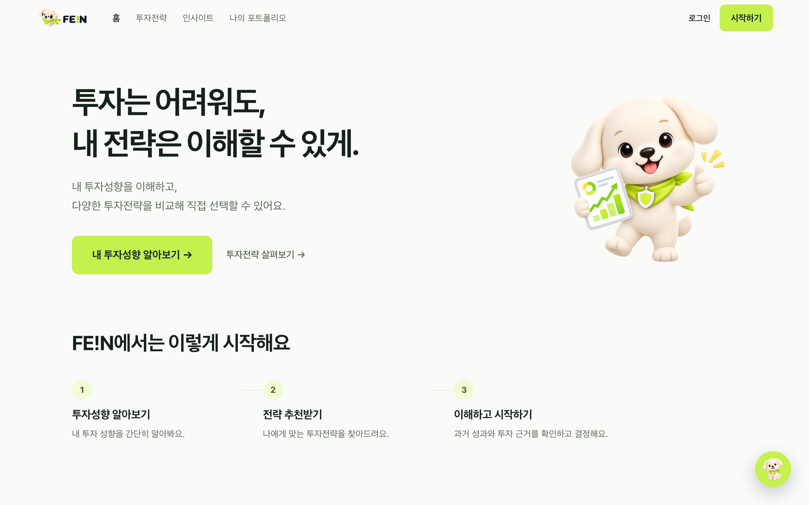
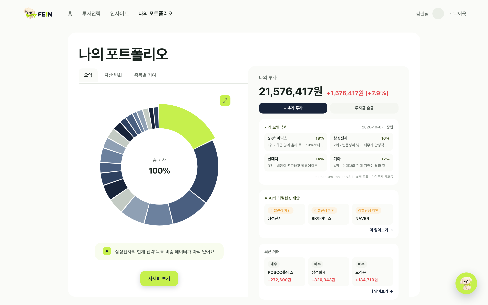
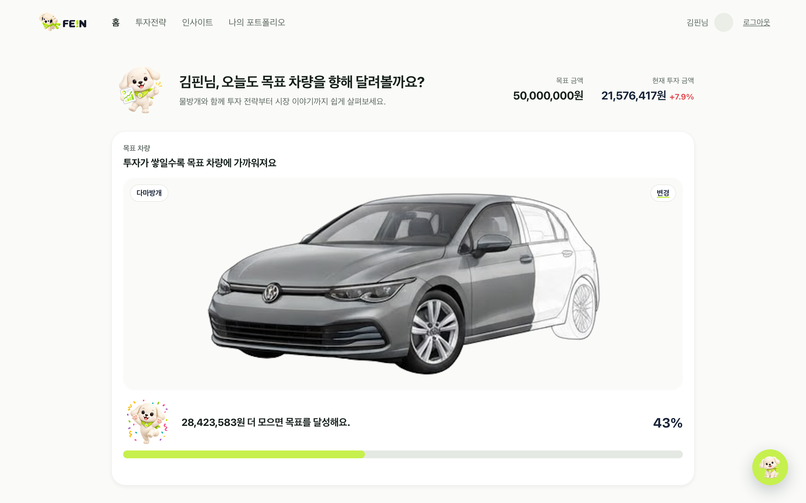
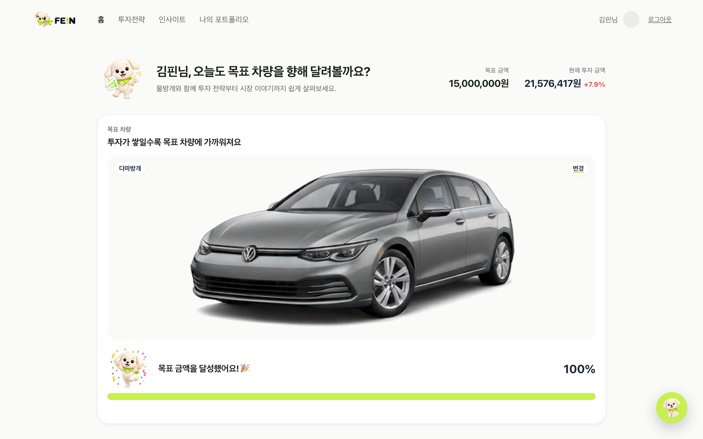
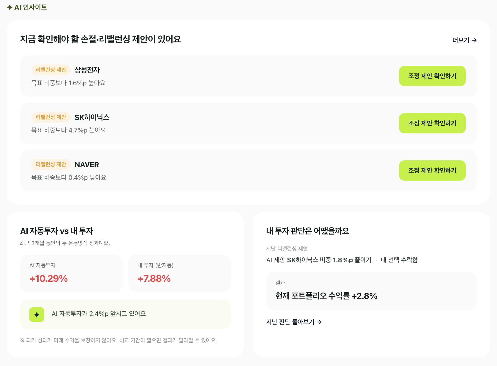
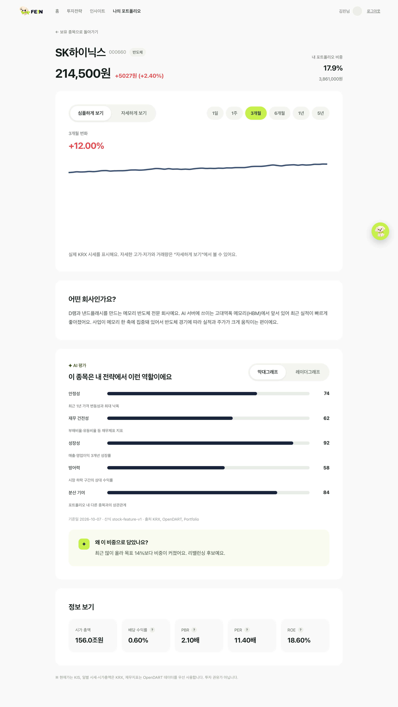
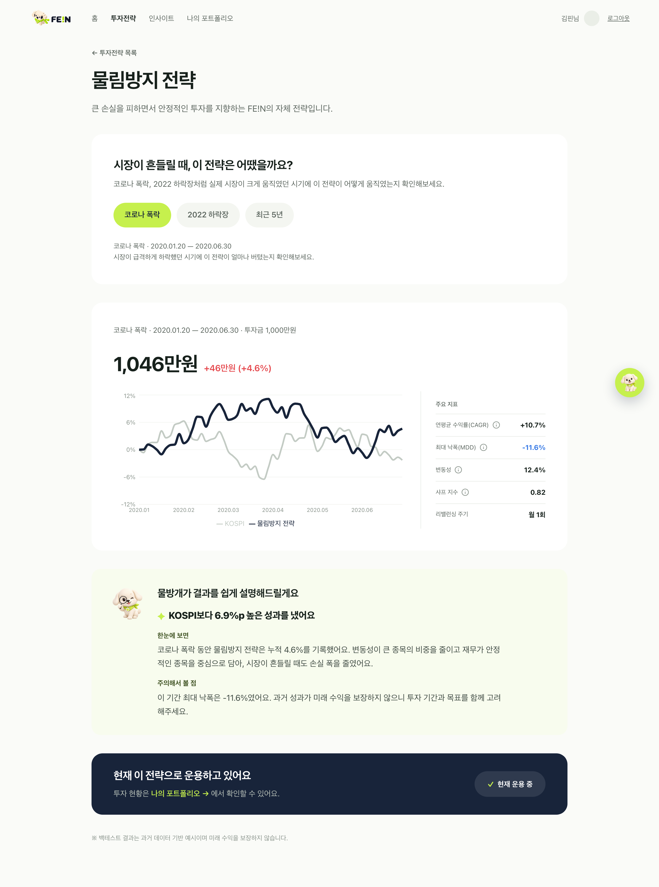
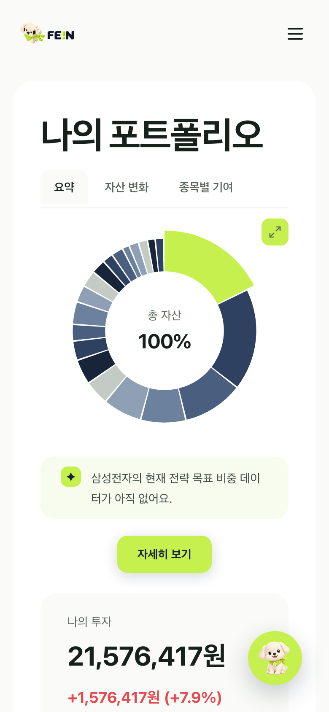

<div align="center">


# FE!N — 쉽고 안전하게 시작하는 AI 가상투자

**투자성향 진단부터 전략 백테스트, 가상 매매, 포트폴리오 분석까지**<br/>
처음 투자하는 사람이 "무엇을 살까"보다 "나에게 맞는 방식은 무엇일까"를 먼저 이해하도록 돕는 서비스

### [🔗 라이브 데모 바로가기](https://fein-financial-engineering-intellig.vercel.app/)

`아무 아이디 / 비밀번호로 로그인` · 모든 데이터는 가상입니다

</div>

<p align="center"></p>

---

## 프로젝트 정보

| | |
|---|---|
| 과정 | SeSAC 3차 프로젝트 · 1팀 (6인) |
| 기간 | 2026.08.10 ~ 2026.08.31 |
| 내 역할 | **프론트엔드** — 포트폴리오 화면, 홈 목표 차량 위젯, 디자인 시스템 정비 (필요한 백엔드 API 연동 포함) |
| 기여 | 커밋 78개 (merge 제외) |
| 원본 저장소 | [SeSAC-3nd-Team1/FEIN-financial-engineering-intelligent-navigation](https://github.com/SeSAC-3nd-Team1/FEIN-financial-engineering-intelligent-navigation) |

> 이 저장소는 포트폴리오 공개를 위해 팀 저장소를 fork한 것입니다.
> 프로젝트 종료 후 백엔드(Azure) 리소스가 정리되어, 데모는 **브라우저 안에서 동작하는 목업 API**로 화면을 재현합니다. → [데모 구성](#데모-구성)

## 기술 스택

`React 19` `TypeScript` `Vite` `Tailwind CSS` `Zustand` `Recharts` `Vitest`

팀 전체: FastAPI · PostgreSQL · Redis · Azure Container Apps · KIS / KRX / OpenDART 데이터 · GitHub Actions

---

## 내가 만든 기능

### 1. 포트폴리오 화면



가상계좌의 자산 현황을 한눈에 보여주는 서비스의 핵심 화면을 처음부터 구현했습니다.

- **요약 화면** — 총자산·수익률, 보유 비중 도넛 차트, 오늘의 손익, AI 리밸런싱 제안
- **상세 분석 대시보드** — Power BI 스타일로 `오늘 / 전략 / 내 자산 / AI 인사이트` 섹션을 성격별로 재배치
  - 자산 변화(KOSPI 대비 누적 수익률), 종목별 수익 기여도, 리밸런싱 판단 기록
- **운용 방식별 화면 분리** — 직접 판단하는 반자동 사용자와 자동매매 사용자(`PortfolioAuto`)의 화면을 따로 설계
- **보유 종목 / AI 제안 전체 목록** 페이지, 거래 내역 및 상세

### 2. 목표 차량 저축 위젯 (홈)

| 진행 중 (43%) | 목표 달성 (100%) |
|---|---|
|  |  |

"투자 금액이 목표 차량 가격까지 얼마나 모였는지"를 보여주는 동기부여 위젯입니다. **기획 → UI → API → DB까지 직접 연결**했습니다. 캐릭터 디자인은 팀과 함께 진행했습니다.

- 보급형 / 고급형 차량 등급을 모달로 선택하고, 목표 금액 직접 입력
- 진행률에 따라 차량 이미지와 캐릭터 응원 문구가 바뀌고, 목표 달성 시 축하 화면 노출
- 상태 로직을 `useCarGoal` 훅으로 분리해 홈 상단 요약과 카드가 같은 값을 공유 (중복 요청·불일치 방지)
- 계정 단위로 서버에 저장 (`/me/car-goal` API, DB 모델·마이그레이션) — 백엔드 담당 팀원이 하차한 뒤, 기존 API 구조를 이어받아 직접 구현

### 3. 디자인 시스템 정비

- 화면 곳곳에 흩어져 있던 raw hex 색상을 **이름 있는 Tailwind 토큰으로 편입** (radius · elevation · heading 스케일 포함)
- 팔레트 밖 색상이 들어오면 **빌드가 실패하는 CI 가드레일**(`check:colors`) 추가
- 모바일(md 미만)에서 헤더를 햄버거 메뉴로 전환, 색상 대비 · 포커스 등 접근성 QA 수정

### 4. 리밸런싱 제안 · 판단 기록



- 목표 비중과의 차이를 "높아요 / 낮아요"와 조정 금액으로 풀어서 보여주는 리밸런싱 제안
- 제안을 수락 · 보류한 **판단 기록**을 남기고, 이후 실제 수익률로 판단을 돌아보는 화면
- 진입 지점에 따라 "돌아가기" 목적지가 달라지도록 화면 이력 처리
- 투자성향 진단 결과의 Source of Truth를 백엔드 분석 응답으로 통일, 미설정 사용자 안내 모달

---

## 기술적으로 고민한 점

### 비동기 응답 경쟁(race condition) 방지

로그인 직후 투자성향을 비동기로 불러오는 동안 사용자가 로그아웃하거나 다른 계정으로 로그인하면, **늦게 도착한 이전 사용자의 응답이 새 사용자의 상태를 덮어쓰는** 문제가 있었습니다.

- 응답을 반영하기 직전에 요청 시점의 토큰과 현재 토큰이 같은지 확인해 지난 응답을 버림
- 같은 토큰으로 진행 중인 요청은 재사용해 중복 호출 제거
- 사용자가 바뀌는 모든 지점(로그인 · 로그아웃 · 인증 실패)에서 투자성향 상태를 함께 초기화

→ [`authStore.ts`](frontend/src/store/authStore.ts)

### 클라이언트 값을 믿지 않기

목표 차량의 "현재 투자 금액"을 처음에는 클라이언트가 보내 저장했는데, 코드 리뷰에서 **요청을 조작하면 실제와 다른 금액을 저장할 수 있다**는 지적을 받았습니다. 이 값을 요청에서 제거하고 서버가 계좌를 직접 조회해 계산하도록 바꿨으며, 화면에서는 이미 갖고 있는 실시간 포트폴리오 값을 그대로 써서 왕복 지연도 없앴습니다.

→ [`useCarGoal.ts`](frontend/src/hooks/useCarGoal.ts)

### 목업이 실제 데이터처럼 보이지 않게

개발 초기에 쓰던 목업 보유종목이 **실제 계좌가 있는데도 로딩 중이나 조회 실패 시 잠깐 노출**되는 문제가 있었습니다. 금융 서비스에서 가짜 수익률이 진짜처럼 보이는 것은 치명적이라, 목업 fallback 조건을 "계좌가 없음이 확인된 경우(`accountMissing`)"로 통일하고 로딩 · 실패 · 빈 상태를 구분해 표시했습니다.

### 백엔드 없이 데모 살리기

프로젝트 종료 후 백엔드 리소스가 삭제되어 화면이 동작하지 않게 됐습니다. 기존 API 코드를 한 줄도 바꾸지 않고, 앱 시작 시 `fetch`를 가로채 `/api/v1/*` 요청에 목업 응답을 돌려주는 계층을 추가했습니다.

→ [`mockApi.ts`](frontend/src/mock/mockApi.ts)

---

## 그 밖의 화면

| 종목 상세 | 전략 백테스트 | 모바일 |
|---|---|---|
|  |  |  |

> 종목 상세 · 전략 백테스트 화면은 팀원과 함께 만든 화면으로, 서비스 흐름을 보여주기 위해 함께 싣습니다.

---

## 데모 구성

```
React 앱 ──fetch('/api/v1/...')──▶ mockApi (브라우저 안에서 가로챔) ──▶ 목업 JSON 응답
```

- 로그인 · 포트폴리오 · 종목 차트 · 백테스트 · 리밸런싱 · AI 비교 · 챗봇 등 약 45개 API를 재현
- 입금 · 리밸런싱 판단 등 사용자가 바꾼 상태는 브라우저(localStorage)에만 저장되며, 상단 배너의 **데이터 초기화** 버튼으로 되돌릴 수 있습니다
- `VITE_MOCK_API=false`로 실행하면 실제 백엔드 API를 호출합니다

### 로컬 실행

```bash
cd frontend
npm ci
npm run dev
```

---

## 팀 프로젝트 전체 문서

서비스 전체 구조, 백엔드 · 데이터 파이프라인, API · DB 명세는 팀 원본 README를 옮겨 둔 [docs/PROJECT_OVERVIEW.md](docs/PROJECT_OVERVIEW.md)와 [docs/](docs/) 폴더에서 볼 수 있습니다.
